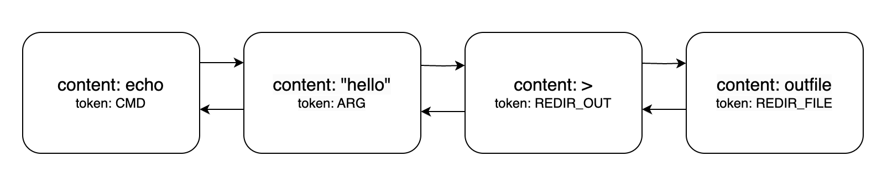
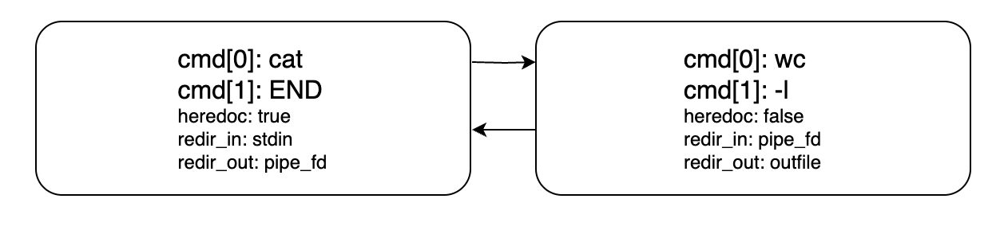

# Minishell
🐚Tan bonito como shell🐚


Antes de empezar el proyecto, es conveniente hacerse una idea de la utilidad de las [funciones autorizadas](https://github.com/erivero-p/42-Tutorials/blob/master/Minishell%20functions/Funciones%20Autorizadas%20en%20Minishell.md).

Para comportarse como una shell nuestro programa deberá tomar la línea de entrada (lexer) y analizarla para jerarquizar cada una de las acciones a realizar (parser). El resultado de este análisis es un abstract syntax tree, con el cual, el ejecutor podrá trabajar y ejecutar los comandos recibidos. Además, deberá gestionar señales recibidas, y liberar  memoria y cerrar archivos abiertos cada vez que se reciba una nueva línea.

Por tanto, globalmente, nuestro programa se va a dividir en:

- Main
- AST: Lexer y parser
- Executer
- Signal handing
- Free utils

# Main

La main function en este caso deberá:

- Checkear que el número de argumentos es el correcto (0)
- Setear el control de señales
- Inicializar las variables y estructuras pertinentes
- Iniciar el bucle durante el que:
    - Se leerá la entrada con `readline`
    - Se llamará a lexer, parser y ejecutor
    - Se añadirá la entrada al historial

# AST: abstract syntax tree

Un AST es una estructura de datos en forma de árbol que representa la estructura sintáctica de un programa o una expresión en un lenguaje de programación. Cada nodo en el árbol representa un elemento sintáctico, como una expresión, una instrucción o un operador, y los nodos hijos representan partes más pequeñas de esa estructura.

```
                         __ PIPELINE__
                     ___/              \____
                    /                       \
            COMMAND                    __ PIPELINE _
          /        \                  /             \
    ARGUMENTS   REDIRECTIONS      COMMAND         _ COMMAND __
        |          |     |           |           /            \
       cat        <<     >       ARGUMENTS    ARGUMENTS   REDIRECTIONS
                   |     |         |   |      |   |   |        |
                 "..."  file      wc  -c      tr  -d " "       >
                                                               |
                                                             file2
```

El ************************************analizador léxico************************************ o **********lexer********** se encargará de dividir la entrada en tokens o unidades léxicas básicas, y el **********************************************analizador sintáctico********************************************** o **********************************************parser********************************************** verificará que la secuencia de tokens se ajuste al lenguaje de la shell y construirá la estructura de árbol correspondiente.

## Lexer

Nuestro lexer está preparado para recibir la string con la línea de entrada, e irá iterando a través de la misma, separando cada uno de los elementos que encuentre, y clasificándolos en función de si se trata de un comando, un token de redirección, una pipe, un argumento, etc.

⚠️ Habrá ocasiones en las que los elementos no estén separados por espacios `cmd<infile` y casos en los que los espacios no separarán elementos: `"hello     bye”`. No será tan sencillo como llamar a `ft_split` usando los espacios como delimitadores. ⚠️

El resultado será una lista enlazada en la que cada nodo guarde el tipo de unidad léxica encontrada, junto con el contenido de la misma. Por ejemplo “echo” y CMD para indicar que es un comando, o “<” y redir_in.

Por ejemplo, para el comando `echo "hello" > ouutfile`, la lista del lexer sería:



## Parser

En nuestro caso, el lexer ya hace ciertas funciones de parseo, al diferenciar entre comando, argumento y archivo de redirección. El lexer, por tanto, tiene menos trabajo que hacer. Iterará por la lista que ha generado el lexer, y creará un nodo para cada comando. En dicho nodo se guardarán el comando a ejecutar y sus argumentos en un array bidimensional, los fd de los archivos a redireccionar si los hubiera, y algunas flags con información útil para el ejecutor, como si hay o no heredocs, o pipes.

⚠️ Para tomar los fd de los archivos de redirección, hay que llamar a open durante el parseo. Es importante cerrar todos los archivos que abramos. Esto también se puede realizar durante el ejecutor. ⚠️

El resultado será una lista enlazada en la que cada nodo será un comando a ejecutar, y que contenga la información de qué hacer con la salida de dicho comando.

Por ejemplo, para el comando `cat << END | wc -l > outfile`, la lista del parser sería:


# Executer

El ejecutor tomará la lista del parser y:

- Revisará el comando cmd[0] para comprobar si se trata de una builtin, en cuyo caso llamará a la función pertinente. En caso contrario, llamará a `execve`.
- Tomará el resto de argumentos cmd[1++] y los pasará por extensor y limpieza de comillas.
- Llamará a las funciones de redirección, de forma que si hay un heredoc se inicie el bucle, y si es necesario, se devuelvan los stdin y stdout tras la llamada a las builtin.
- Configurará las pipes en caso de haberlas.

# Manejo de señales

Las señales funcionarán de distinta forma si estamos o no en modo interactivo. En el caso de `Ctrl + D`, no habrá problema si hemos hecho bien el resto de nuestro código, ya que, cerrará el proceso hijo si estamos en el mismo, y si no, cerrará la shell.

El caso de `Ctrl + C` es algo distinto. Deberemos considerar si estamos o no en una builtin (si nuestras builtin no funcionan con procesos hijos), y también deberemos tener en cuenta si estamos en un heredoc. Para esto podremos valernos de una variable global.
